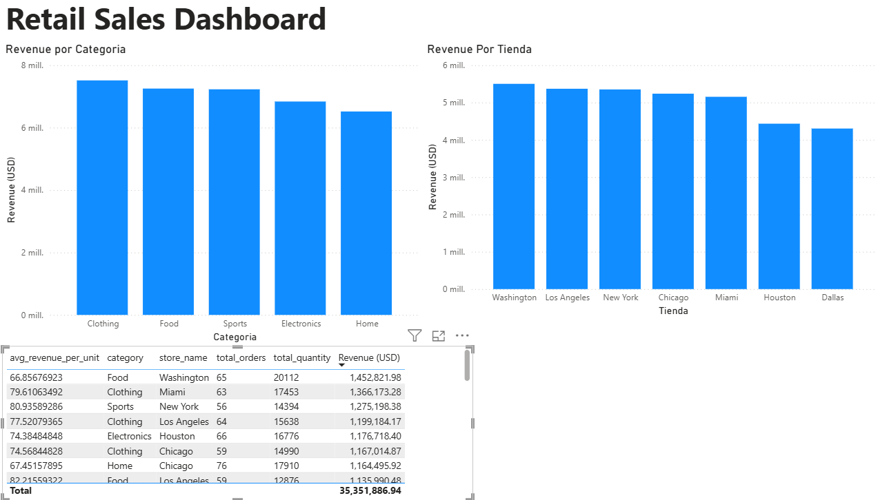

# Retail Data Pipeline

## TL;DR
Data pipeline that generates synthetic retail sales data, processes it with Python, stores it in SQLite, and produces business metrics ready for Power BI dashboards.

---

## Overview

This project simulates a retail data pipeline.

It generates synthetic sales data for a retail store, cleans and processes the data using Python, loads it into a SQLite database, and produces business metrics such as revenue by category, top products, and revenue by store.

The final outputs are CSV files ready to be used in Power BI dashboards.

---

## Data Pipeline Architecture

Raw Data → Processing → Storage → Analytics → Visualization

---

## Tech Stack

| Technology | Purpose |
|------------|------------|
| Python     | Pipeline logic and data processing |
| Pandas     | Data cleaning and transformation |
| SQLite     | Data warehouse |
| SQL        | Business queries and metrics |
| CSV        | Raw and processed data storage |
| dbt        | Data transformation, modeling, and SQL-based analytics |
| Power BI   | Data visualization |

---

## Project Structure


```text
retail-pipeline/
│
├── data
│   ├── raw
│   │
│   └── processed
│       ├── sales_clean.csv
│       ├── sales_by_category.csv
│       └── sales_by_store.csv
│
├── ingestion
│   └── ingest.py
│
├── transformation
│   └── transform.py
│
├── warehouse
│   ├── load.py
│   ├── queries.py
│   └── retail.db
│
├── reporting
│   └── export.py
│
└── README.md
```

---

## Data Flow

1️⃣ **Data Generation / Ingestion**

Synthetic retail sales data is generated (2,000 rows) including:

- product
- category
- customer
- store
- order date
- quantity
- price

2️⃣ **Transformation**

Python scripts clean the data and calculate:

- total revenue per order
- normalized datasets for analysis

3️⃣ **Data Warehouse**

Clean data is loaded into **SQLite**.

4️⃣ **Business Metrics**

SQL queries generate key metrics such as:

- revenue by category
- top selling products
- revenue by store

5️⃣ **Reporting**

The results are exported as CSV files ready for **Power BI dashboards**.

---

## How to Run

### 1 Clone the repository
git clone https://github.com/orlandomtz77/retail-pipeline.git

cd retail-pipeline

### 2 Install dependencies
pip install pandas

### 3 Run the pipeline

Execute each stage of the pipeline:
```bash
python ingestion/ingest.py
python transformation/transform.py
python warehouse/load.py
python reporting/export.py
```

---

## Output

The pipeline generates the following datasets:

- **sales_clean.csv** → cleaned sales data
- **sales_by_category.csv** → revenue by product category
- **sales_by_store.csv** → revenue by store

These files can be directly connected to **Power BI** for dashboard creation.

---

## Future Improvements

- Add Airflow orchestration
- Use PostgreSQL instead of SQLite
- Add data validation tests
- Deploy pipeline to the cloud

## dbt Models

The project follows a layered modeling approach:

### stg_sales (Staging Layer)
This model cleans and standardizes raw sales data.

- Renames columns for consistency
- Casts data types (dates, numeric fields)
- Removes null or invalid records
- Prepares data for downstream transformations

---

### fct_sales (Fact Layer)
This model represents the core business transactions.

- Calculates total revenue per order
- Defines the grain at the order level
- Ensures clean, structured data for analytics
- Serves as the main fact table for analysis

---

### rpt_sales_summary (Reporting Layer)
This model aggregates data for business insights.

- Revenue by category
- Revenue by store
- Top selling products
- Optimized for dashboard consumption (Power BI)

